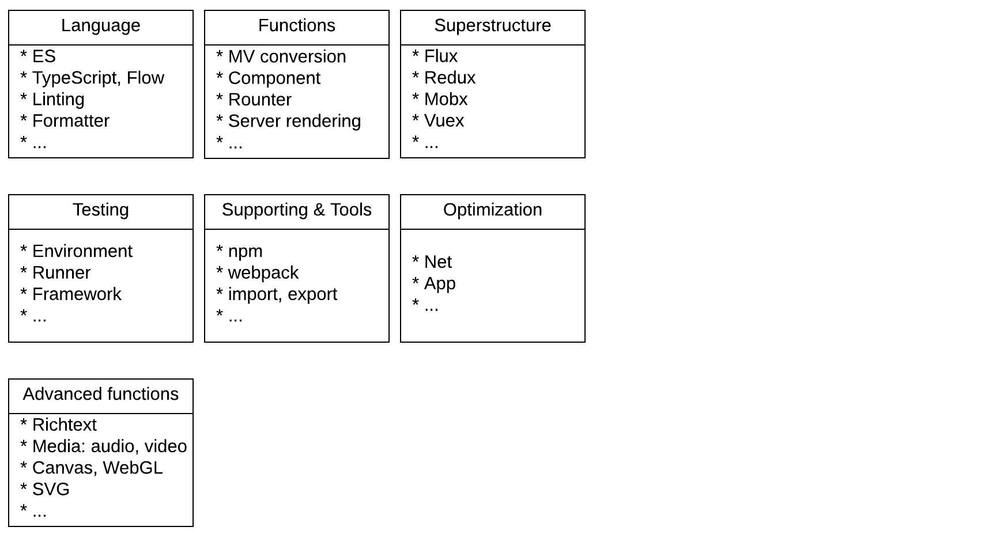

# Frontend Architecture

## Table of Contents
* Language
  * Syntax sugar & function focused evolution ( ES )
  * Strong typed extension ( TypeScript, Flow )
  * Transpilation
  * Linting
  * Formatter ( prettier )
* Functions
  * Model View conversion
  * Tree-based componnent system
  * Router
  * Server rendering
* Superstructure
  * Flux
  * Redux
  * Mobx
  * Vuex
* Testing
  * Environment
  * Automatic tools ( runner )
  * Framework 
* Supprting & Tools
  * Source manager ( npm, yarn )
  * Build system ( webpack, rollup )
  * Dependency management ( import, require )
* Optimization
  * Net
  * App
* Advanced functions
  * Richtext
  * Media: audio, video
  * Canvas, WebGL
  * SVG
